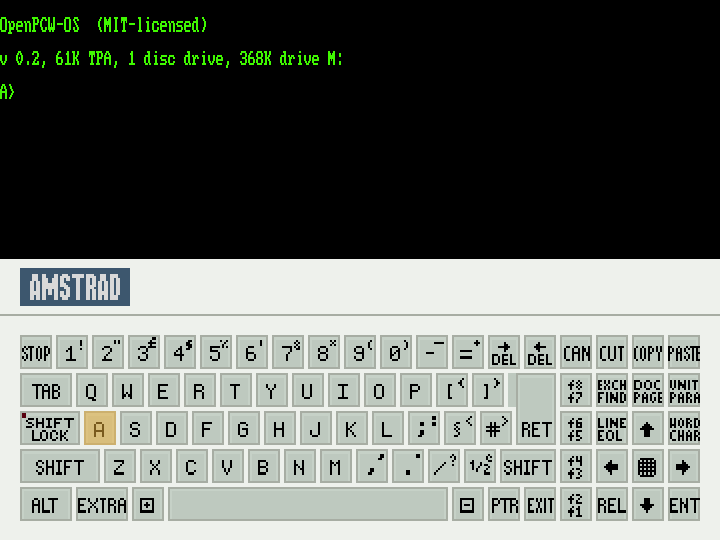

<!-- SPDX-License-Identifier: GPL-3.0-only -->
<!-- Copyright (c) 2026 retrodiv <retrodiv@proton.me> -->

# ZEsarPCW — Amstrad PCW libretro core

ZEsarPCW is an Amstrad PCW 8256/8512 core for libretro/RetroArch, derived from
[ZEsarUX 13.0](https://github.com/chernandezba/zesarux). Its selectable machine
targets and frontend are PCW-only. Native ZEsarUX menus, ZXVision, networking,
text-adventure analysis and other inaccessible application tools are excluded.
The published source is pruned physically as well as at link time: retained
upstream units contain only their selected libretro/PCW branches, and Z80
extensions or hardware paths belonging exclusively to other machines are
replaced by the PCW behaviour. Release checks reject either class of regression.

The [changes from ZEsarUX 13.0](licenses/MODIFICATIONS.md#changes-from-zesarux-130)
describe individual PCW fixes, their previous behaviour and the current solution,
alongside the libretro adaptations and loader compatibility workarounds.

Amstrad and PCW identify the emulated hardware, including the Amstrad logo shown
on the on-screen keyboard. ZEsarPCW is an independent project, not affiliated
with, sponsored by or endorsed by the hardware manufacturer or trademark holders.

A [native C bootstrap](docs/BOOTSTRAP.md) starts PCW disks without an external
BIOS or bundled Amstrad firmware. The MIT-licensed
[**OpenPCW-OS**](https://github.com/retrodiv/OpenPCW-OS) helper disk is embedded. The complete helper disk and its
shell-ready integration metadata are reproducibly generated by the canonical
standalone project.
[`sources/openpcw-os/`](sources/openpcw-os/) preserves its version,
licences, the upstream `LICENSES.txt`, original integration JSON, source identity,
artifact hashes, and provenance. Its [reconstruction tool](sources/openpcw-os/SOURCE.md)
can verify a matching standalone source tree and regenerate the embedded headers.
See
[AUTHORS](AUTHORS), the core [LICENSE](LICENSE) and
[`licenses/PROVENANCE.md`](licenses/PROVENANCE.md) before redistributing binaries
that contain the embedded data.

OpenPCW-OS is a project-authored, standalone, CP/M-compatible game
loader. Its boot chain, shell, keyboard, display, disk services and supported
application interfaces have native Z80 implementations using documented PCW
hardware. The same generated disk boots without ZEsarPCW-specific services in
independent PCW emulators and is intended for real PCW hardware; ZEsarPCW's
integration waits for the native shell, restores the content disk and types the
selected launch command.

The standalone project provides optional native MAME and JOYCE integration
tests. Their results apply to the exact disk tested; an integration update
requires fresh validation. Physical PCW execution remains an intended target.
See [`sources/openpcw-os/SOURCE.md`](sources/openpcw-os/SOURCE.md) for the
canonical source pointer and pinned project identity.



OpenPCW-OS with the on-screen keyboard, displayed at the core's 4:3 aspect ratio.
The capture contains no commercial game.

## Install in RetroArch

1. Extract the release ZIP for your operating system and CPU architecture.
   Keep its licences and source archives with the package.
2. In RetroArch, open **Settings → Directory**. Copy the library
   (`zesarpcw_libretro.so`, `.dll` or `.dylib`) into the directory for cores, and
   `zesarpcw_libretro.info` into **Core Info**. Use writable directories if your
   installation's defaults are read-only. Keep the original file names.
3. Restart RetroArch, select **Load Core → Amstrad - PCW (ZEsarPCW)**, then
   **Load Content** and choose a `.dsk` or `.m3u` file. No BIOS installation is
   needed. Manual installation does not depend on Core Updater availability.
4. Select the PCW model and other settings in **Quick Menu → Core Options**.
   For a physical keyboard, enable **Game Focus** (Scroll Lock by default).
   Press the same key again to restore frontend hotkeys. The binding can be
   changed under **Settings → Input → Hotkeys → Game Focus (Toggle)**.

These copy instructions apply to RetroArch installations that allow loading
external cores. For background, see libretro's
[core information guide](https://docs.libretro.com/development/cores/developing-cores/#add-your-core-to-libretro-infrastructure)
and [keyboard controls](https://docs.libretro.com/guides/input-and-controls/).

## Licence and credits

ZEsarPCW's emulator and port code are distributed under the **GNU General Public
License, version 3**; see [LICENSE](LICENSE). The original ZEsarUX source notices
also permit later GPL versions and remain intact. This software comes without
any warranty, including implied warranties of merchantability or fitness for a
particular purpose. [AUTHORS](AUTHORS) credits the contributors, and
[MODIFICATIONS](licenses/MODIFICATIONS.md) records the changes made by this port.

Some bundled components retain their own terms:

| Component | Terms and notices |
|---|---|
| Canonical libretro API header | Its original permissive notice is preserved in [`libretro.h`](src/libretro/libretro.h). |
| OpenPCW-OS disk and integration metadata; Microsoft MS-DOS display font | MIT; preserve the [upstream notices](sources/openpcw-os/LICENSES.txt). The GPLv3 reconstruction tool and C templates do not change the terms of the embedded data. |
| Floppy sound recordings from David Colmenero's PituKa/wiituka | GPL version 2 or later, distributed here using version 3; [source and credits](sources/fdc/README.md). |
| MAME-derived catalogue identifiers, titles and disc fingerprints | CC0-1.0; [catalogue provenance](licenses/MAPPINGS.md). The port's control bindings, annotations and generators are GPLv3. |

The `.info` file's `GPLv3` entry describes the core code. It does not assign that
licence to every bundled resource or grant rights to the software on users'
discs. Preserve the relevant component notices when redistributing those
resources. The native PCW bootstrap is port-authored GPLv3 code; its
[functional basis and compatibility boundary](docs/BOOTSTRAP.md) are documented.
The hardware names and keyboard depiction have a separate
[identification notice](licenses/AMSTRAD.md).

## Build and check

For binary distribution, use the public [package builder](PACKAGING.md), which
ships the checked library together with licences, notices and its exact source
archive. `make` remains the ordinary contributor build command.

Requires a C compiler and `make`; the checker and Python tools require
**Python 3.10 or newer**. The public tools are tested with Python 3.10.21 and
3.14. This repository contains the sources and embedded resources required
for an offline core build. Editing YAML mappings or WAV samples needs only
Python's standard library; regenerating PNG skins needs the pinned Pillow
dependency. Rebuilding OpenPCW-OS also needs Pasmo and its matching source
archive. See the [asset instructions](sources/README.md).

```sh
make platform=unix -j4       # zesarpcw_libretro.so
make platform=linux-aarch64 CC=aarch64-linux-gnu-gcc -j4 # Linux AArch64
make platform=linux-x86 CC=i686-linux-gnu-gcc -j4       # Linux x86 (32-bit)
make platform=linux-armv7 CC=arm-linux-gnueabihf-gcc -j4 # Linux ARMv7/armhf
make platform=osx -j4        # zesarpcw_libretro.dylib
make platform=win -j4        # zesarpcw_libretro.dll (mingw-w64)
make platform=win32 -j4      # Windows x86 (i686-w64-mingw32-gcc)
make platform=unix check -j4 # build + libretro API/unit/runtime checks
```

Objects, dependency files and the linked library live under `build/<platform>/`.
Make copies the selected library to the repository root, including when switching
back to a previously built platform. Run `make clean` before changing the compiler, SDK
or flags for the same platform. `CC` from the environment or command line is
respected, including MXE's `x86_64-w64-mingw32.static-gcc` with `platform=win64`.
Without a caller-selected `CC`, Windows x86-64 uses `x86_64-w64-mingw32-gcc`,
`win32` uses `i686-w64-mingw32-gcc`, macOS uses
`clang` and other platforms use `gcc`. Android needs the NDK compiler passed as
`CC`. `CPPFLAGS`, `CFLAGS`, `LDFLAGS` and `LDLIBS` are honoured.

Linux AArch64 can also build natively with `platform=unix CC=gcc`. For Linux
x86, `platform=linux-x86` (alias `linux-i686`) passes `-m32` to compilation and
linking; native GCC on x86-64 needs its 32-bit development libraries installed.
The i686 libretro buildbot uses `platform=unix ARCH=x86` with the same flags.
The checker verifies the requested Linux/Windows architecture in the binary;
32-bit libraries require a 32-bit RetroArch build.
Linux ARMv7 (alias `linux-armhf`) uses ARMv7-A, VFPv3-D16 and the hard-float ABI;
NEON is not required. Use an armhf compiler and a matching Linux frontend.

On macOS, `platform=osx` builds for the compiler's native architecture;
`osx-x86_64` and `osx-arm64` select an architecture explicitly. For libretro's
Apple cross-build contract, set `CROSS_COMPILE=1`, `LIBRETRO_APPLE_PLATFORM`
(for example `arm64-apple-macos11`) and `LIBRETRO_APPLE_ISYSROOT` (the SDK path).
Both the target and SDK reach compilation and linking. Native builds honour
Clang's `MACOSX_DEPLOYMENT_TARGET`; the checker inspects the Mach-O architecture
and minimum macOS version. An arm64 request earlier than macOS 11 is promoted
to 11 by the Apple toolchain.

Android ARM64 and ARMv7 support the NDK's `ndk-build` interface used by the libretro
buildbot. With `NDK_ROOT` pointing to an installed Android NDK (tested with r26d):

```sh
"$NDK_ROOT/ndk-build" -C jni APP_ABI=arm64-v8a -j4
python3 check.py --core ./libs/arm64-v8a/libretro.so --platform android-arm64
"$NDK_ROOT/ndk-build" -C jni APP_ABI=armeabi-v7a -j4
python3 check.py --core ./libs/armeabi-v7a/libretro.so --platform android-armv7
```

This recipe targets Android API 21+, uses the source list and required compiler
flags in `Makefile.common`, and produces `libs/<abi>/libretro.so`. Supported ABIs
are `arm64-v8a` and `armeabi-v7a`; omitting `APP_ABI` builds both. ARMv7 uses
Android's softfp calling convention and the current NDK's
[NEON baseline](https://developer.android.com/ndk/guides/abis#v7a). Both the standalone
Makefile and NDK recipes align ELF load segments
for devices with 4 KiB or 16 KiB memory pages, including with NDK r26d;
`check.py` verifies the requested ARM architecture and 16 KiB load alignment.
This does not replace execution tests on an Android device and its frontend.
Its `obj/` and `libs/` outputs are ignored by Git;
use `"$NDK_ROOT/ndk-build" -C jni clean` to remove them. Release ZIPs are built
with [package.py](PACKAGING.md), which includes the corresponding sources and
notices.

Only the 25 standard `retro_*` API functions are exported. Linux and Android
builds enable full RELRO/BIND_NOW; the standalone Makefile compiles maintained libretro glue
with `-Wall -Wextra -Werror` while inherited shared-upstream warning debt remains
outside that strict boundary.

The [libretro distribution guide](docs/LIBRETRO.md) describes the supplied
buildbot recipes, platform filenames and the remaining infrastructure registration
steps for RetroArch's **Core Downloader**.

`make check` tests the compiled core, its metadata and its public API. Unit
tests and the runtime host use native `cc`, independently of the core
compiler; override it with `HOST_CC` or `check.py --cc`. Runtime checks run on
matching Linux/macOS hosts and are explicitly deferred for cross builds. It
also works after local source changes; it does not require reproducing the original
release hashes or installing image-generation dependencies. Editable assets and
their regeneration commands are documented under [`sources/`](sources/README.md).

## Content and discs

See the [security policy](SECURITY.md) for input trust boundaries, private
vulnerability reporting and precautions when sharing diagnostics or save states.

Supply your own software images with the rights needed to use them. Commercial
games, LocoScript and original CP/M system discs are not supplied by this
project, and the project's licences do not grant rights to those programs.
The bundled helper environment is OpenPCW-OS; its notices are listed above.

Load `.dsk` images or `.m3u` playlists. Archive extraction is delegated to the
frontend; the core itself advertises `dsk|m3u` consistently. M3U paths may be
relative to the playlist, comments start with `#`, and `path|Display label` is
supported. For example, save this as `game.m3u` beside the two images:

```text
# Both paths are relative to this playlist
Game - Side A.dsk|Side A
Game - Side B.dsk|Side B
```

Load the playlist itself to make both discs available to Disc Control.
File paths supplied by libretro and UTF-8 playlist entries also support Unicode
directory and disc names on Windows, independently of its active ANSI code page.

Use Quick Menu → Disc Control in the normal eject → select → insert order. Save
states include the complete mounted disc buffer, including guest writes. The core
does not write those changes back to the original host file.

Load save states with the same machine model (8256 or 8512) that created them.
To use a state from another model, select that model and reload the content first.
States never switch the running model or replace the RAM exposed to the frontend.
States include in-flight floppy commands, transfer buffers, timing and the
OpenPCW-OS handoff, so they can resume during disk loading as well as play.
The current save-state format is v1, independent of the core release version.
Native bootstrap progress is required. Earlier development states and unknown
format versions are rejected before changing the running session; there are no
legacy readers or migrations.

Disc selection is preserved while the tray is open, so Next/Previous Disc
continues from the selected image. Loading an ejected-disc state also preserves
that selection and its saved disc contents for the next insertion.

Diagnostics use the frontend's libretro logger, with `stderr` as a fallback.
An engine initialization failure rejects the content and releases its resources.
A fatal emulation error stops the session and requests shutdown through libretro;
if the frontend declines, the session stays stopped until content is reloaded.

## Input and core options

The host keyboard maps printable keys, function keys, modifiers, navigation keys
and the PCW keypad where ZEsarUX has a PCW equivalent. Enable RetroArch Game Focus
(normally Scroll Lock) to prevent frontend hotkeys consuming keyboard events.

`Physical keyboard mapping` keeps that original passthrough in `Default`. Select
`Custom` to reveal one option for each of the 82 keys on the generic PCW keyboard
(the current legends/matrix are the UK model); each can use its suggested default,
be unmapped, or be assigned to any of 105 UK ISO host keys. Duplicate assignments
are allowed. This physical map is independent of the UK/US artwork selected for the
on-screen keyboard.

RetroPad mappings are selected locally from the disc fingerprint and shown through
input descriptors. A core option reserves any digital RetroPad button for opening
and closing the OSK (Select by default). R3 keeps the title's own menu/exit key;
SELECT+START aliases that R3 action without assuming it always means quit.

To assign keys **directly in Controls**, select **Port 1 Controls → Device
Type → Custom Keyboard Bindings**, then select a button. This uses the native
keyboard device, like DOSBox Pure's **Custom Keyboard Bindings**, and opens
RetroArch's complete keyboard selector without modifying RetroArch. The frontend
sends these assignments as keyboard events; the core does not additionally
apply the automatic RetroPad profile or the Select+Start chord.

RetroArch owns these remaps and initially leaves them unassigned. Load
[`pcw-keyboard-defaults.rmp`](sources/mappings/pcw-keyboard-defaults.rmp) from
**Controls → Manage Remap Files → Load Remap File** for Left O, Right P,
Up Q, Down A, Start Return and B Space. The preset also assigns A Return,
Y Right Control (EXIT), X Left Shift, Select Tab, L Escape (STOP), R Left
Control (EXTRA) and R3 Escape. Save a game remap file to retain edits per game.

The native selector uses RetroArch's PC keyboard names: Space → PCW SPACE,
Return → RET, Escape → STOP, Left Control → EXTRA and Right Control → EXIT.
Letters, numbers, arrows, modifiers and the editing keypad keep their normal
physical-key equivalents. With **Physical keyboard mapping = Default**, the
following additional equivalents make all 82 PCW keys accessible in this mode:

| RetroArch key | PCW key |
| --- | --- |
| F9 | CAN |
| F10 | CUT |
| F11 | COPY |
| F12 | PASTE |
| F13 | Pound/Currency |
| F14 | 1/2 @ |
| F15 | : (Shift + ;) |

These additional F-key equivalents apply only to **Custom Keyboard Bindings**.
An explicitly selected Custom physical keyboard map overrides the equivalents.

Core options expose model, video mode/palette, phosphor colour, AY/beeper, crop,
audio rate, drive sound, physical-key mapping and input behaviour. Options v0 and
v2 are supported.

## Features

- native per-mode PCW resolution and smart/fixed crop;
- green, white and amber monochrome phosphor plus colour-board modes;
- real keyboard, per-title RetroPad profiles and gamepad OSK;
- mechanical floppy sound, cheats, save states and rewind;
- M3U/extended Disk Control with real eject state;
- editable asset sources and reproducible generators.

The preferred editable WAV, PNG and YAML sources for generated assets, together
with their generators and pinned Python dependency, are included under
[`sources/`](sources/README.md). Use them to modify the assets and rebuild the core.

## Cheats

For codes handled by the core, use address/value pairs such as `35899 0`,
`POKE 35899,0` or `0x8C3B 0x00`. Decimal, `0x` hexadecimal and `$` hexadecimal
numbers are accepted. Each enabled code writes its bytes before every frame.
Use addresses from 0 to 65535 and byte values from 0 to 255.

These POKEs address the Z80's **logical 64 KiB address space**, through the
PCW's current bank mapping. RetroArch's own cheat search sees the exposed
**physical RAM** (256 KiB on the 8256, 512 KiB on the 8512). A search result's
physical offset is not automatically a valid POKE address: which physical bank
appears at a logical address can change while the program runs. In RetroArch,
select the **Emulator** cheat handler for the POKE codes described here; the
**RetroArch** handler uses the frontend's memory interface. See the
[cheat guide](https://docs.libretro.com/guides/cheat-codes/).

## Support and contributions

Use this repository's **Issues** tab for bug reports, questions and concerns
about a distributed file or its attribution. Include the core and RetroArch
versions, platform, PCW model, reproduction steps and a relevant log excerpt.
The [contribution guide](CONTRIBUTING.md) explains local development, diagnostics
and the optional rewind benchmark. Report results from physical hardware or
other emulators with the exact image and environment tested.
